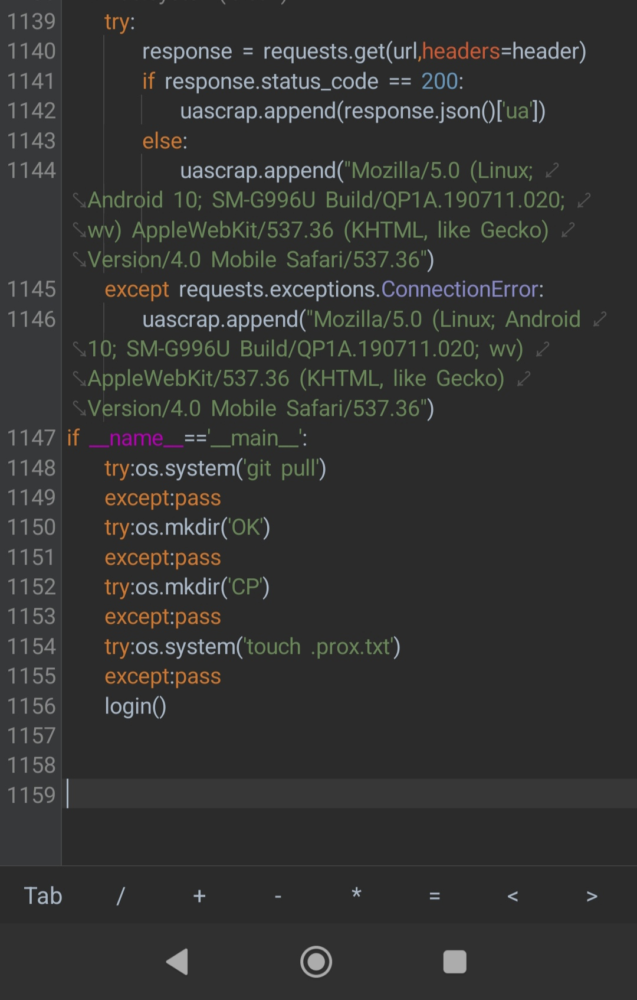
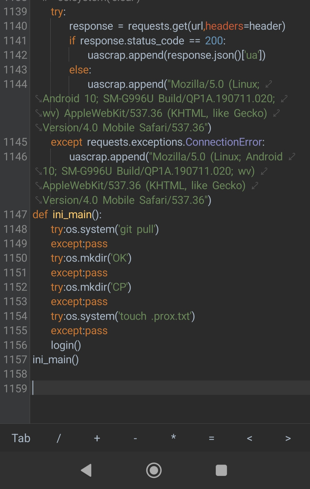

<p align="center"> 
 PENGUNJUNG 

 
</p>

<p align="center">
  Script by: FIRZAH
</p>

[](https://git.io/typing-svg)

- **note** sebelum di enc code nya ubah dulu sistem main nya menjadi def biar kedetek cython.

<br>
<p align="center">
  
</p>

<br>
<p align="center">
  
</p>

## 🚀 Install and Run

Untuk menginstal dan menjalankan script encode ini, ikuti langkah-langkah berikut:

```sh
pkg install git -y
pip install requests
pip install cython
pip install setuptools
pip install pycryptodome
git clone https://github.com/FIRandZAH/Compile
cd Compile
python compile.py
```


##  🤝  Hubungi saya

Butuh bantuan atau ada pertanyaan?  Silakan hubungi saya melalui:

* **WhatsApp:** https://wa.me/6283170597744
* **Email:** [firzah48@gmail.com](mailto:firzah48@gmail.com) 

